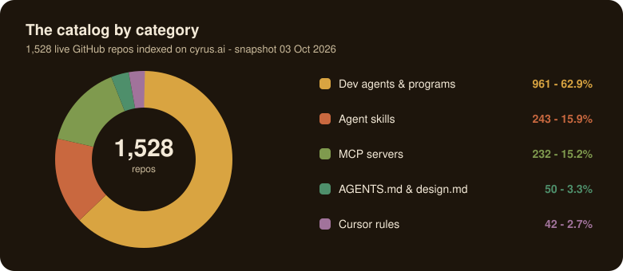
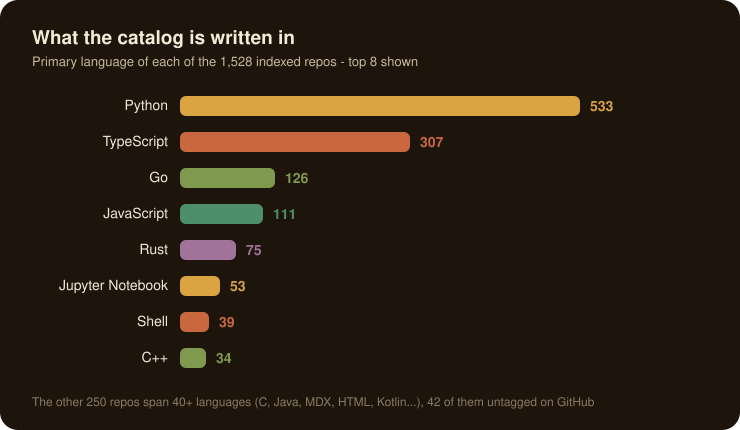
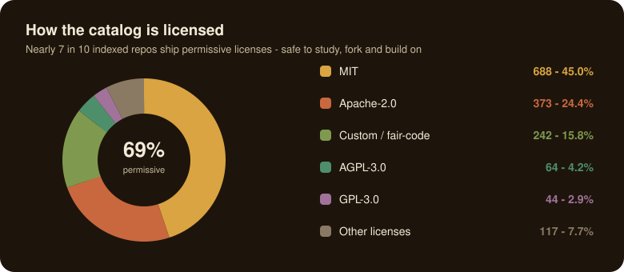
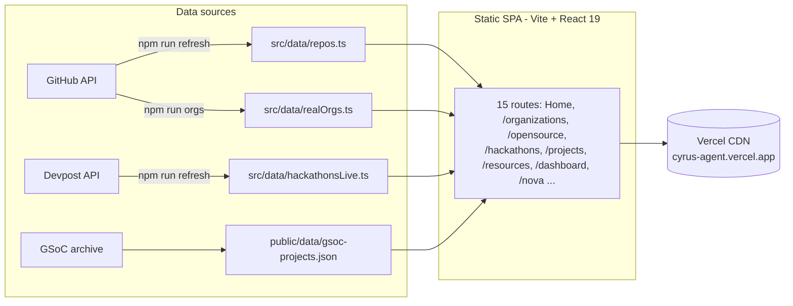

<p align="center">
  
</p>

<h1 align="center">cyrus.ai</h1>

<p align="center">
  <a href="https://cyrus-agent.vercel.app"></a>
  <a href="https://github.com/adityalenova/cyrus-ai"></a>
  <a href="https://github.com/adityalenova/cyrus-ai"></a>
  <a href="https://github.com/adityalenova/cyrus-ai"></a>
  
</p>

<p align="center">
  
  
  
  
  
</p>

A developer-program platform: it turns the scattered world of **AI-agent tooling, open-source programs and hackathons** into one browsable, self-refreshing catalog with real sign-in. Built as a fully static Vite + React 19 SPA - no backend to host, yet it tracks over half a million data points pulled straight from GitHub, Devpost and Google Summer of Code archives.

---

## By the numbers

| Section | What the site holds | Where the data comes from |
|---|---|---|
| Agent-skills catalog | **1,528 repos** · 33.79M stars · 4.61M forks | GitHub REST via `gh api`, re-fetched by `npm run refresh` |
| Open-source programs | **5,238 GSoC projects** (2021-2025) · 305 mentoring orgs · 3,075 tech tags | Google Summer of Code archive JSON |
| Program deep dives | **8 programs** with stats and charts (GSoC, GSSoC, LFX, Outreachy, Eclipse SoC, MLH, KDE, Hacktoberfest) | curated in `src/data/programDetails.ts` |
| Hackathon board | **161 events** - 18 curated + 143 live Devpost listings with deadlines and prize pools | `devpost.com/api/hackathons` |
| Organizations | **43 org pages** with live follower, repo and star intel | `scripts/fetch-orgs.mjs` |
| Learning resources | **58 first-party resources** from the companies shipping the tools | curated |

## The catalog at a glance

<p align="center">
  
</p>

<p align="center">
  
</p>

<p align="center">
  
</p>

## The shape of the app



Everything renders client-side from typed, checked-in snapshots - the site boots instantly, works offline after first load, and the refresh scripts rewrite the datasets in place whenever you re-run them.

## Sign-in, actually real

No demo auth. Both providers run real OAuth against this static bundle:

- **Google** - raw OIDC implicit flow (full-page redirect, no GIS dependency); the `id_token` comes back in the URL fragment, nonce verified against `sessionStorage`.
- **GitHub** - OAuth **PKCE (S256)** in a popup; the code lands on same-origin `github-callback.html` and is post-Messaged back. Browsers can't call GitHub's token endpoint (no CORS), so a tiny relay holds the client secret: `npm run gh-relay` locally, a Cloudflare Worker in production.


Security stance: the repo and the browser bundle contain **only public client ids** (Vite `VITE_*` vars). The one secret in the system lives in an untracked local file (dev) or a Worker secret (prod), never in git, never in the page.

## Pages

| Route | What it is |
|---|---|
| `/` | Warm editorial home: programs, hackathon shelves, org marquee, FAQ |
| `/organizations` + `/organizations/:login` | 43 real GitHub orgs with live stats and program participation |
| `/opensource` + `/programs/:id` | Contribo listing of 5,238 GSoC projects, filter by year/org/tech |
| `/hackathons` + `/hackathons/:id` | 161 events, deadlines, prize pools, prep playbooks, "The brief" panel |
| `/projects` | The 1,528-repo agent-skills catalog, downloadable |
| `/resources` + `/resources/:id` | 58 first-party learning resources with why/use notes |
| `/dashboard` | Signed-in home: profile, saved items, activity |
| `/nova` | nova.ai recommender - suggests skills + hackathons from your stack |
| `/repo/:id` | Repo detail with stats, tags, related projects |

## Run it locally

```bash
git clone https://github.com/adityalenova/cyrus-ai && cd cyrus-ai
npm install
cp .env.example .env          # optional - fills in public client ids
npm run dev                   # http://localhost:5330
npm run build                 # tsc --noEmit (strict, noUnusedLocals) + vite build
```

Optional pieces:

```bash
npm run gh-relay              # local GitHub token-exchange relay on :8787
                              # needs the OAuth app secret in .github-secret (untracked)
npm run refresh               # re-pull Devpost hackathons + catalog data
npm run orgs                  # regenerate realOrgs.ts from live GitHub
```

`.env` is gitignored; only these three vars exist:

```
VITE_GOOGLE_CLIENT_ID=...     # public OAuth client id
VITE_GITHUB_CLIENT_ID=...     # public OAuth app client id
VITE_GITHUB_EXCHANGE_URL=...  # relay URL (local :8787 or Cloudflare Worker)
```

## Deploy

Static build on **Vercel** - `vercel.json` carries the Vite preset and the SPA rewrite so every route resolves. Three environment variables in project settings, and both OAuth apps need the production origin registered (Google: JS origin + redirect URI; GitHub: single callback URL `<origin>/github-callback.html`).

## Tech notes

- React 19 + react-router 7, TypeScript 5 strict, Tailwind v4 (CSS-first config), Vite 6
- Zero runtime dependencies beyond React - charts, covers and the recommender are computed in-app
- Data pipeline: Node ESM scripts under `scripts/` using `gh api` and public JSON endpoints
- Warm "Contriho" design system - coffee/bean/honey/foam palette, display + mono pairing, light/dark themes

---

Private project, built by [Aditya Duggirala](https://github.com/adityalenova). All catalog numbers belong to their respective orgs and organizers; every listing links out to its official page.
