<p align="center">
  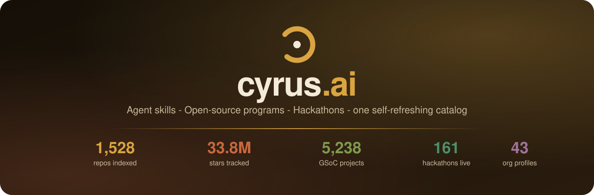
</p>

<h1 align="center">cyrus.ai</h1>

<p align="center">
  <b>The developer-program platform.</b> 1,528 AI-agent repos, 6,682 open-source program projects and 161 live hackathons - one warm, fast, self-refreshing catalog with <b>real OAuth sign-in</b> and <b>zero backend to host</b>.
</p>

<p align="center">
  <a href="https://cyrus-agent.vercel.app"></a>
  <a href="#-by-the-numbers"></a>
  <a href="#-by-the-numbers"></a>
  <a href="#-by-the-numbers"></a>
  <a href="#-by-the-numbers"></a>
  
</p>

<p align="center">
  
  
  
  
  
  
  
  
</p>

<p align="center">
  <table>
    <tr>
      <td align="center"><b>🚀 Start</b><br/><a href="https://cyrus-agent.vercel.app">Open the site</a><br/><a href="#-quick-start">Run locally</a><br/><a href="#-deploy-on-vercel">Deploy</a></td>
      <td align="center"><b>🧭 Explore</b><br/><a href="https://cyrus-agent.vercel.app/projects">Skills catalog</a><br/><a href="https://cyrus-agent.vercel.app/hackathons">Hackathon board</a><br/><a href="https://cyrus-agent.vercel.app/opensource">Programs explorer</a></td>
      <td align="center"><b>🔌 Data &amp; auth</b><br/><a href="#%EF%B8%8F-architecture">Refresh pipeline</a><br/><a href="#-sign-in-actually-real">OAuth design</a><br/><a href="#-see-it-in-action">Screenshot tour</a></td>
    </tr>
  </table>
</p>

---

## 💥 The promise

> **Works like a product, ships like a static site.**

- **One catalog for the whole agent boom** - skills, Cursor rules, AGENTS.md files, MCP servers and dev agents: all 1,528 of them, filterable, with their real GitHub stats, downloadable as JSON.
- **Programs, not guesswork** - 6,682 mentored open-source projects (5,238 GSoC 2021-2025, 941 LFX, 503 Outreachy and Season of Bots) across 402 organizations with thousands of tech tags, plus deep-dives on 8 programs (GSoC, GSSoC, LFX, Outreachy, Eclipse SoC, MLH, KDE, Hacktoberfest).
- **Never miss a build window** - 161 hackathons (18 curated + 143 live Devpost listings) with deadlines, prize pools, cover art and prep playbooks.
- **A dashboard that remembers you** - saved projects and organizations, a watchlist, mentor finder, org matcher, org comparison and a personal "next steps" checklist, all stored locally until you sign in.
- **nova.ai** - the in-site recommender: describe what you want to build, get the skills, orgs and programs that fit, with reasoning.
- **Real sign-in** - Google OIDC and GitHub OAuth with PKCE, verified end to end. No fake "demo mode".
- **No database, no server** - typed JSON snapshots checked into the repo, regenerated by scripts. The site boots instantly and deploys as pure static files.

## 📸 See it in action

Every shot below is the live site, captured at 1440px in the light "Contriho" theme.

<table>
  <tr>
    <td width="50%">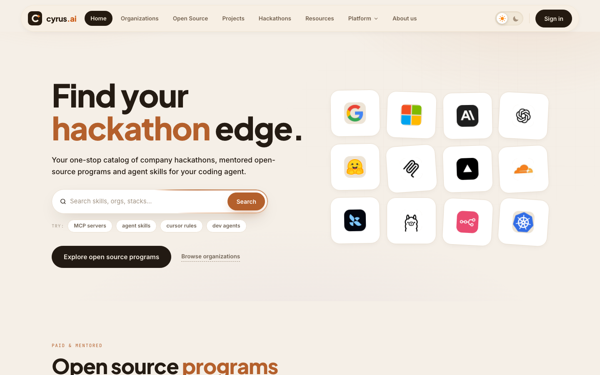</td>
    <td width="50%">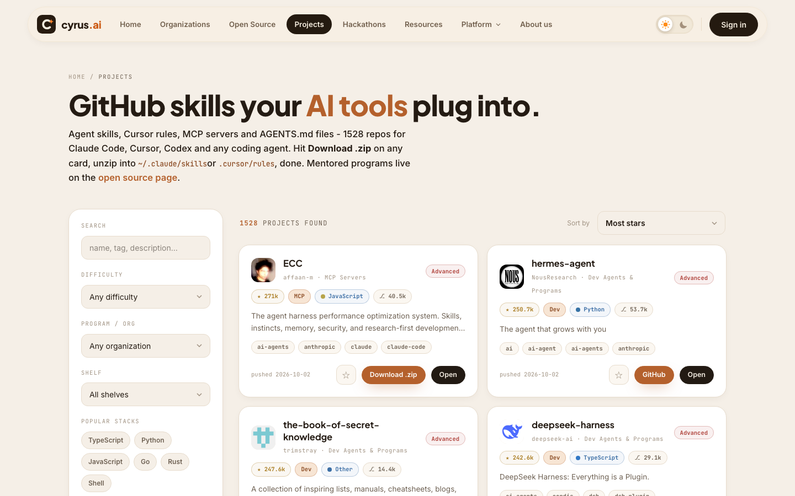</td>
  </tr>
  <tr>
    <td align="center"><b>Home</b> - warm editorial start with search, program shelves and the org marquee</td>
    <td align="center"><b>Skills catalog</b> - 1,528 repos with a filter rail, live stats and JSON export</td>
  </tr>
  <tr>
    <td>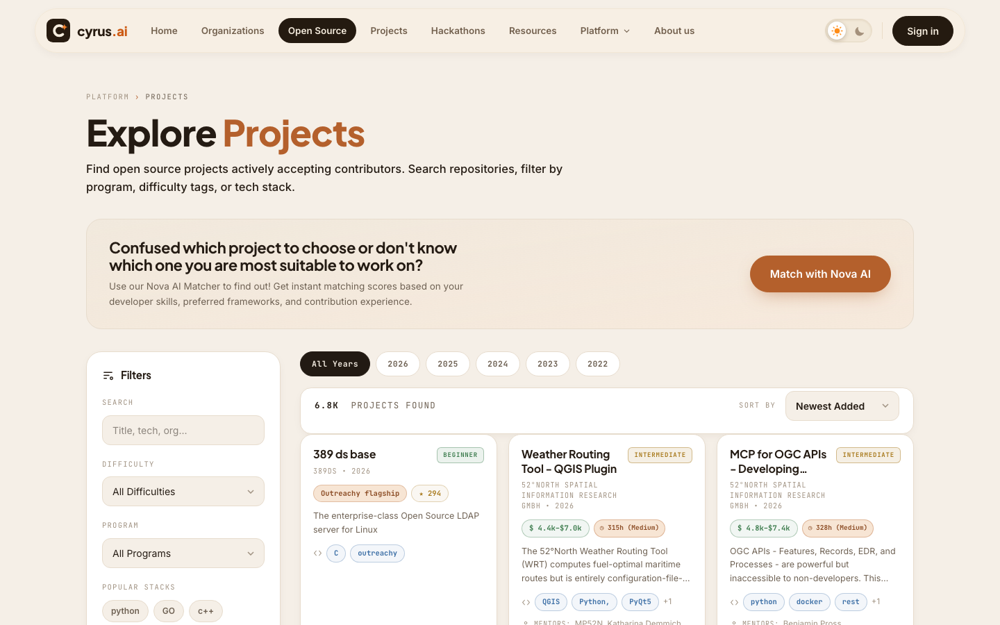</td>
    <td>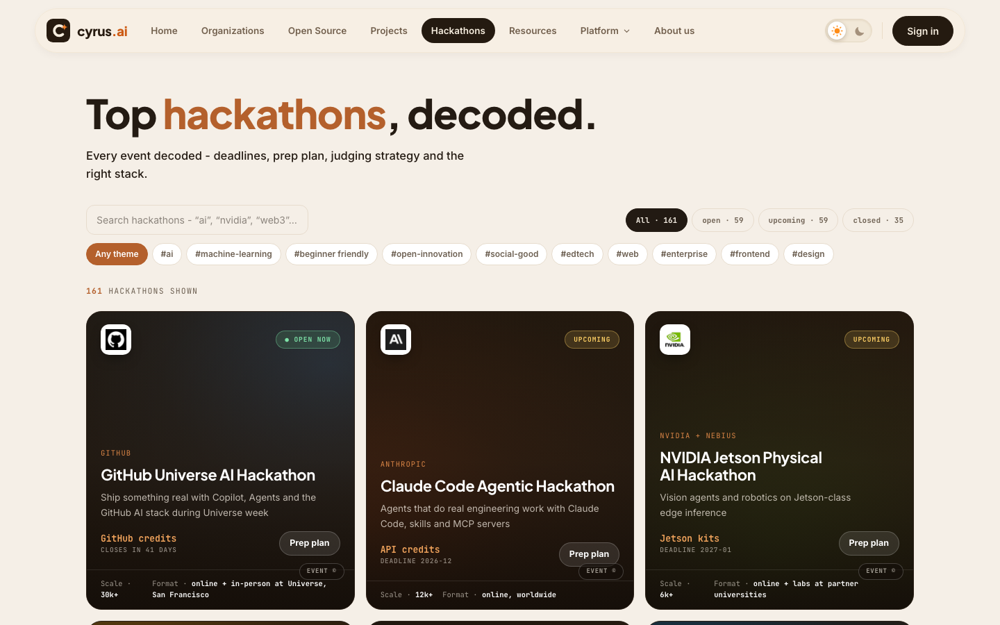</td>
  </tr>
  <tr>
    <td align="center"><b>Programs explorer</b> - 6,682 mentored projects, filter by year, org and tech</td>
    <td align="center"><b>Hackathon board</b> - deadlines, prize pools and cover art for 161 events</td>
  </tr>
  <tr>
    <td>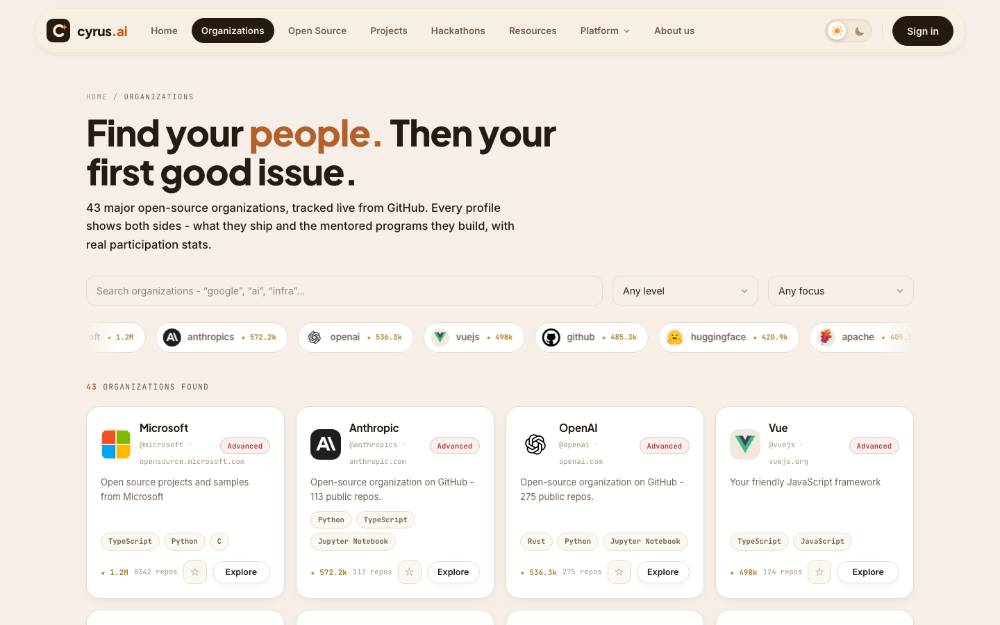</td>
    <td>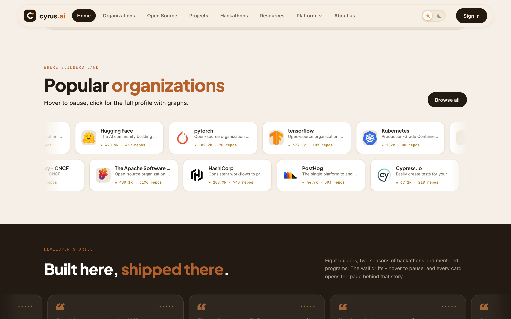</td>
  </tr>
  <tr>
    <td align="center"><b>Organization intel</b> - 43 real GitHub orgs with live stats and program history</td>
    <td align="center"><b>Popular organizations</b> - the two-row drifting marquee on the home page</td>
  </tr>
  <tr>
    <td>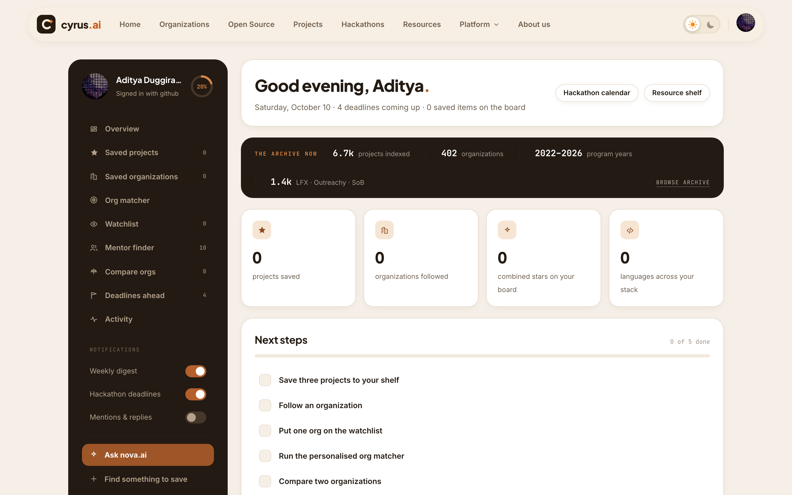</td>
    <td>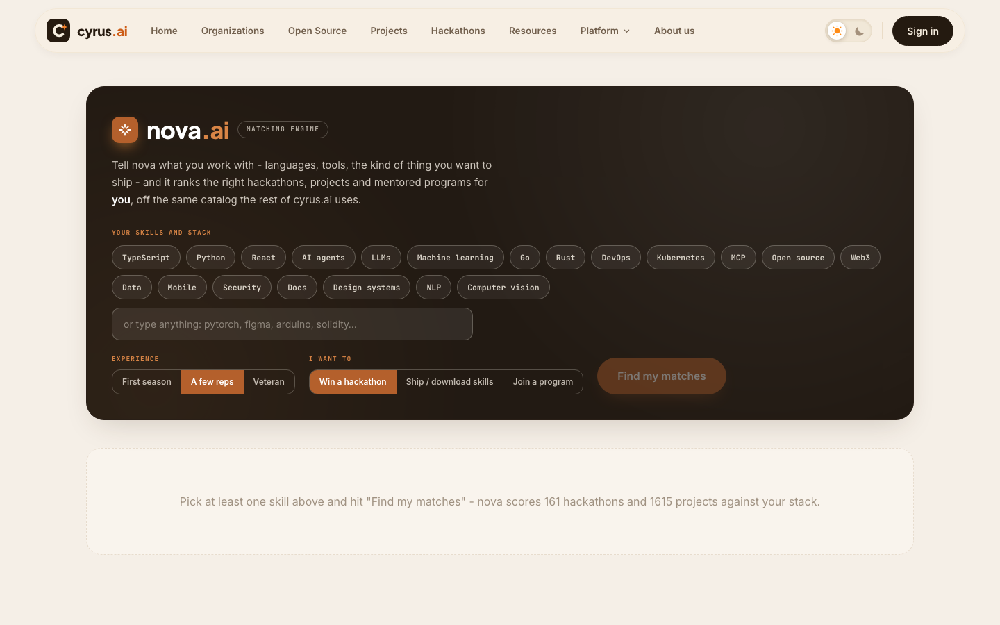</td>
  </tr>
  <tr>
    <td align="center"><b>Dashboard</b> - signed-in home: saved shelf, checklist, deadlines and pulse strip</td>
    <td align="center"><b>nova.ai</b> - describe a build, get matched skills, orgs and programs with reasons</td>
  </tr>
  <tr>
    <td>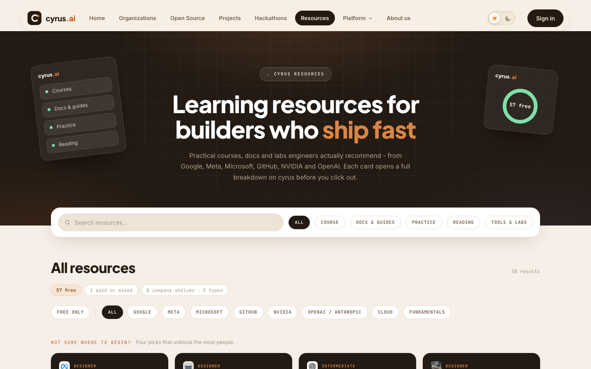</td>
    <td>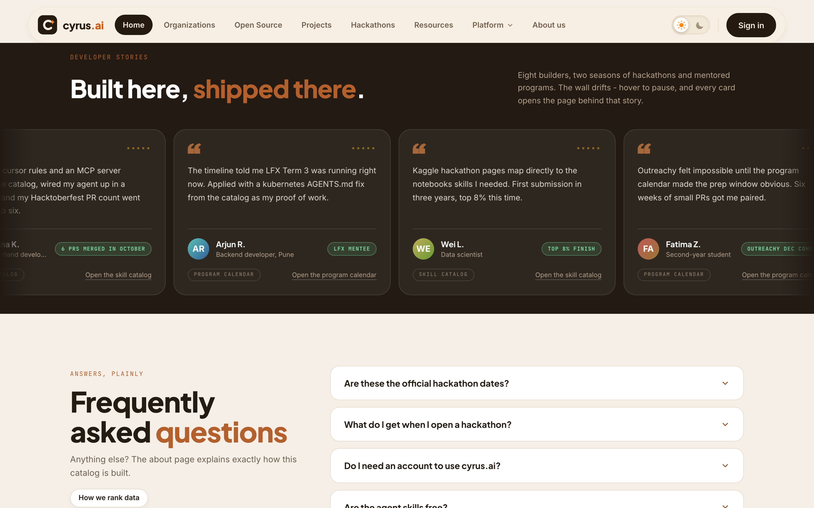</td>
  </tr>
  <tr>
    <td align="center"><b>Resources</b> - 58 first-party learning picks with why-and-when notes</td>
    <td align="center"><b>Developer stories</b> - the testimonial wall drifting on coffee brown</td>
  </tr>
  <tr>
    <td>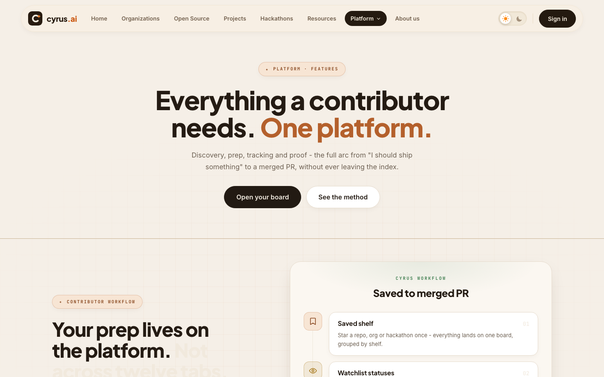</td>
    <td>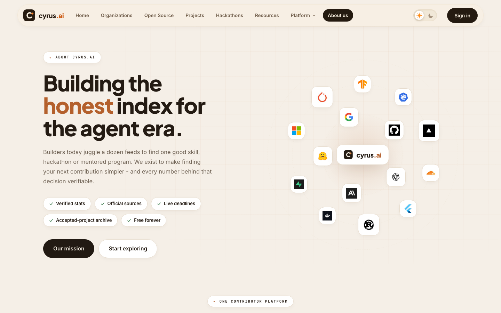</td>
  </tr>
  <tr>
    <td align="center"><b>Platform / Features</b> - one of four marketing pages under <code>/platform/*</code></td>
    <td align="center"><b>About</b> - the orbit hero, capability cards and the companies band</td>
  </tr>
</table>

Dark mode is one click away in the header - the same warm palette, roasted.

## 📊 By the numbers

| Section | Size | Source of truth |
|---|---:|---|
| Agent-skills catalog | **1,528 repos** · 33.79M stars · 4.61M forks | GitHub REST via `gh api` |
| Open-source programs | **6,682 projects** · 402 orgs · 3,075 tags | GSoC archive (2021-2025) + LFX + Outreachy + SoB |
| Program deep dives | **8** full stat pages | `src/data/programDetails.ts` |
| Hackathon board | **161 events** (18 curated + 143 live) | `devpost.com/api/hackathons` |
| Organization intel | **43** live org profiles | `scripts/fetch-orgs.mjs` |
| Learning resources | **58** first-party picks | curated |
| Routes | **22** pages | `src/App.tsx` |

### What the catalog is made of

| Category | Repos | Share |
|---|---:|---:|
| Dev tools & agents | 961 | 62.9% |
| Agent skills | 243 | 15.9% |
| MCP servers | 232 | 15.2% |
| AGENTS.md files | 50 | 3.3% |
| Cursor rules | 42 | 2.7% |

## 📈 The catalog at a glance

<p align="center">
  
</p>

<p align="center">
  
</p>

<p align="center">
  
</p>

## 🧭 Inside the platform

- **Splash-to-site in one beat** - an animated orbit splash hands off to the page; the whole app is a static bundle served from the edge.
- **Light + dark, same soul** - a hand-tuned "Contriho" coffee-and-honey palette with a dainty sun/moon toggle; every token is a CSS variable, so both themes share one source of truth.
- **Living shelves** - counter-drifting marquees for organizations and developer stories, hover to pause, click through to the real profile.
- **Clear section seams** - full-bleed hairline rules divide every marketing section, tuned to stay visible in the light theme.
- **Repo detail that answers questions** - stats, tags, related projects and an honest "why this is here" note on every listing.
- **Self-refreshing data** - `npm run refresh` re-pulls Devpost and the catalog; `npm run orgs` regenerates org intel from live GitHub. The snapshot date is stamped on this README.

## 🗺 Pages

| Route | What it is |
|---|---|
| `/` | Warm editorial home: programs, hackathon shelves, org marquee, stories, FAQ |
| `/organizations` · `/organizations/:login` | 43 real GitHub orgs with live stats and program participation |
| `/opensource` · `/programs/:id` | Contribo listing of 6,682 mentored projects, filter by year / org / tech |
| `/hackathons` · `/hackathons/:id` | Deadlines, prize pools, prep playbooks and "The brief" panel |
| `/projects` | The 1,528-repo agent-skills catalog, downloadable |
| `/resources` · `/resources/:id` | 58 first-party learning resources with why/use notes |
| `/dashboard` · `/nova` | Signed-in home + the nova.ai recommender |
| `/platform/features` · `/platform/nova` · `/platform/trust` · `/platform/how` | Marketing pages for the platform, nova.ai and the trust centre |
| `/about` | The story, the method and the companies behind the index |
| `/repo/:id` | Repo detail with stats, tags and related projects |
| `/privacy` · `/terms` · `/cookies` · `/affiliations` | The honest legal corner |

## ⚡ Quick start

```bash
git clone https://github.com/adityalenova/cyrus-ai && cd cyrus-ai
npm install
cp .env.example .env      # optional - fills in public client ids
npm run dev               # http://localhost:5330
```

```bash
npm run build             # tsc --noEmit (strict) + vite build -> dist/
npm run refresh           # re-pull Devpost hackathons + catalog data
npm run orgs              # regenerate realOrgs.ts from live GitHub
npm run gh-relay          # local GitHub token-exchange relay on :8787
```

Only three env vars exist, all public-safe:

```
VITE_GOOGLE_CLIENT_ID=...     # Google OAuth web client id
VITE_GITHUB_CLIENT_ID=...     # GitHub OAuth app client id
VITE_GITHUB_EXCHANGE_URL=...  # token-exchange relay (local :8787 or Worker)
```

## 🔐 Sign-in, actually real

<details open>
<summary><b>Both providers run real OAuth against a fully static bundle</b></summary>

- **Google** - raw OIDC implicit flow (full-page redirect, no GIS script dependency). The `id_token` returns in the URL fragment; the nonce is verified against `sessionStorage`.
- **GitHub** - OAuth **PKCE (S256)** in a popup. The code lands on same-origin `github-callback.html` and is post-Messaged back. Browsers can't call GitHub's token endpoint (no CORS), so a tiny relay holds the client secret: `npm run gh-relay` in dev, a Cloudflare Worker in production.

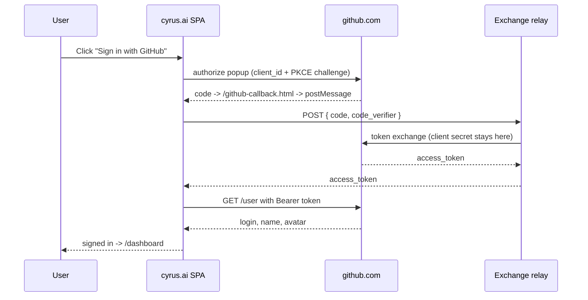

**Security stance:** the repo and the browser bundle contain **only public client ids**. The one secret in the system lives in an untracked local file (dev) or a Worker secret (prod) - never in git, never in the page.

</details>

## 🏗️ Architecture

<details>
<summary><b>How a 10k-dataset site stays a static SPA</b></summary>

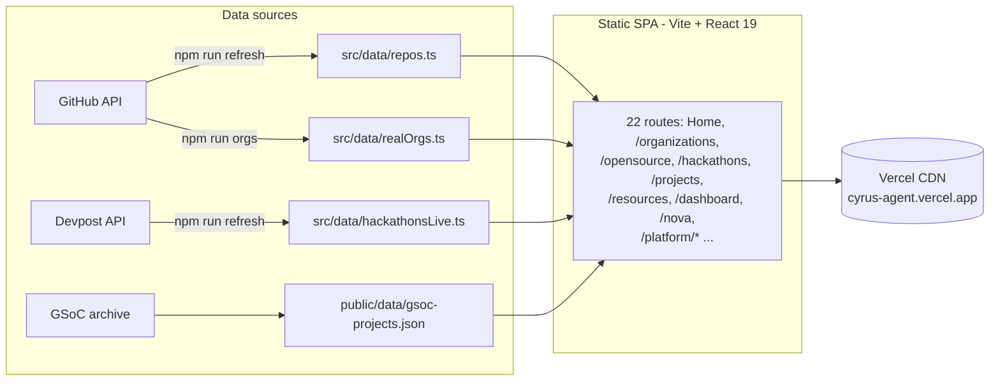

Everything renders client-side from typed, checked-in snapshots. Charts, cover gradients and the nova.ai recommender are computed in-app - zero runtime dependencies beyond React.

```
src/
├── pages/        22 route components
├── components/   chrome, cards, auth modal, platform kit, UI primitives
├── lib/          store, router helpers, google.ts (OIDC), github.ts (PKCE)
└── data/         typed dataset snapshots (repos, orgs, hackathons, programs...)
scripts/
├── refresh.mjs               Devpost + catalog re-pull
├── fetch-orgs.mjs            live GitHub org intel -> realOrgs.ts
├── fetch-covers.mjs          hackathon cover pipeline (sharp)
├── github-exchange.local.mjs dev token-exchange relay (:8787)
└── github-exchange.worker.mjs  Cloudflare Worker relay (prod)
```

</details>

## ☁️ Deploy on Vercel

`vercel.json` carries the Vite preset + SPA rewrite, so importing the repo is all it takes:

1. [vercel.com/new](https://vercel.com/new) → import `cyrus-ai` → Deploy.
2. Add the three `VITE_*` env vars in Project Settings (Production + Preview), then redeploy.
3. Register the production origin with Google (JS origin **and** redirect URI with trailing slash) and GitHub (callback `<origin>/github-callback.html`).
4. For public GitHub sign-in, deploy `scripts/github-exchange.worker.mjs` as a Cloudflare Worker and point `VITE_GITHUB_EXCHANGE_URL` at it.

## 🧩 Tech stack

| Layer | Choice | Notes |
|---|---|---|
| UI | React 19 + react-router 7 | fully client-side SPA |
| Language | TypeScript 5 strict | `noUnusedLocals`, build fails on any error |
| Styling | Tailwind v4 | CSS-first config, warm "Contriho" palette, light/dark |
| Build | Vite 6 | instant dev server, static `dist/` output |
| Data | Node ESM scripts | `gh api` + public JSON endpoints, snapshots in git |
| Auth | Google OIDC · GitHub PKCE | token exchange via local relay / Cloudflare Worker |
| Charts | hand-rolled SVG | catalog charts, program stats, sparklines - no chart lib |
| Hosting | Vercel | SPA rewrite via `vercel.json` |

## 🤝 Contribute & support

This is a solo build that grew into a platform - and it gets better every time someone points out a missing repo, a stale deadline or a broken filter. **Contributions of every size are welcome**, and everyone whose PR gets merged lands on this wall.

**Good first contributions:**

- 📚 **Catalog gaps** - know an agent-skills, MCP or Cursor-rules repo we should index? Open an issue with the `github.com/owner/name` and we'll pull it in on the next refresh.
- 🏃 **Hackathon spot-checks** - if a deadline or prize pool looks off on the board, a one-line fix to `src/data/` is a perfect first PR.
- 🎨 **Design notes** - screenshots of anything that looks off in light or dark mode, at any viewport, are genuinely useful.
- 📊 **Data plumbing** - the scripts in `scripts/` are plain Node ESM; new sources or smarter merges are always interesting.

**How to get started:** fork the repo, run [Quick start](#-quick-start) above, open a pull request. CI is the strict build itself (`npm run build` must pass).

### The people behind it

<table>
  <tr>
    <td align="center" width="120">
      <a href="https://github.com/adityalenova"></a><br/>
      <sub><b><a href="https://github.com/adityalenova">adityalenova</a></b></sub><br/>
      <sub>creator · everything</sub>
    </td>
    <td align="center" width="120">
      <a href="https://github.com/adityalenova/cyrus-ai/pulls"></a><br/>
      <sub><b><a href="https://github.com/adityalenova/cyrus-ai/pulls">your PR here</a></b></sub><br/>
      <sub>first fix earns a slot</sub>
    </td>
  </tr>
</table>

<p align="center">
  <a href="https://github.com/adityalenova/cyrus-ai/pulls"></a>
  <a href="https://github.com/adityalenova/cyrus-ai/issues"></a>
</p>

## 🤍 Support cyrus.ai

Not a code person? The cheapest support with the biggest impact:

1. **Star the repo** - it helps the catalog get discovered by the people who need it.
2. **Share a screenshot** of your dashboard or your favorite org page - the stories wall on the home page is real and hungry for more.
3. **Send one link** to a builder who is trying to pick their first program or hackathon.

## 🙏 Thanks to the data neighbors

Every number on this site belongs to the teams who produced it: Google Summer of Code and its mentoring organizations, the Linux Foundation, Outreachy, Devpost, and the 1,528 open-source repos indexed from GitHub. Each listing links out to its official page.

## 📜 License & credits

Private project, built by [Aditya Duggirala](https://github.com/adityalenova). All catalog data belongs to its respective sources and is republished with attribution and links. Made with too much coffee, in the site's own palette. ☕
